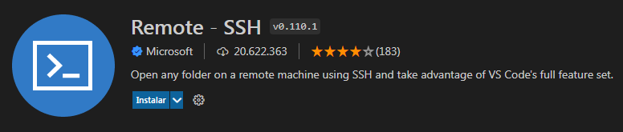
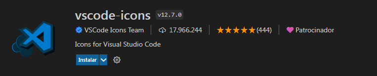
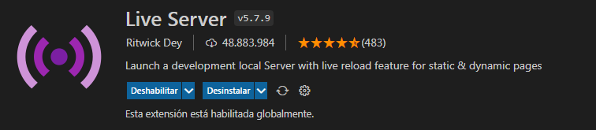
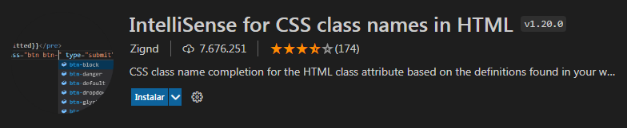
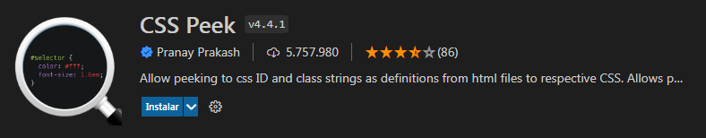
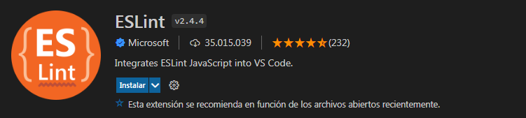
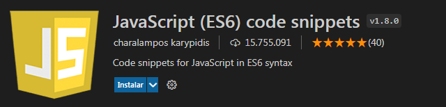
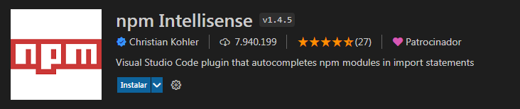
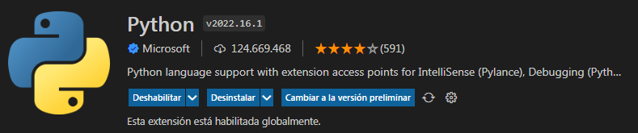
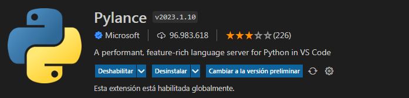

# 🚀 Las mejores Extensiones de Vscode 🚀

Visual Studio Code (VS Code) es un editor de código fuente desarrollado por Microsoft. Es software libre y multiplataforma, disponible para Windows, GNU/Linux y macOS.

A continuación, te presento algunas de sus características clave:
- Multiplataforma: VS Code está disponible en diferentes sistemas operativos, lo que facilita su uso en cualquier entorno de desarrollo.
- IntelliSense: Proporciona autocompletado y resaltado de sintaxis, lo que agiliza la escritura de código.
- Depuración integrada: VS Code ofrece herramientas para depurar tu código directamente desde el editor.
- Control de versiones con Git: Integra funcionalidades para trabajar con repositorios Git.
- Extensiones: VS Code es potente gracias a sus extensiones. Puedes personalizarlo y agregar funcionalidades adicionales de forma modular. Por ejemplo, puedes programar en diferentes lenguajes, cambiar temas, y conectar con otros servicios.  

Acá te dejo una lista interesante de extensiones muy útiles de Visual Studio Code.

## EXTENSIONES DE USO GENERAL

### 1. Prettier

Prettier es una extensión ampliamente adoptada que genera un estilo de código coherente en proyectos de programación principalmente, se utiliza en una amplia variedad de lenguajes de programación que facilita el formateo consistente del código en los proyectos de manera automática mejorando la legibilidad y reduciendo los conflictos relacionados con el estilo.

Características:

- Ideal para lenguajes de programación como JavaScript, TypeScript, CSS, HTML y otros.
- Formatea automáticamente el código en base a reglas predefinidas.
- Da un estilo de código coherente en los proyectos.
- Compatible con otras opciones de formato y puede activarse al guardar o mediante atajos de teclado.

### 2. Remote SSH

Esta extensión te brinda la posibilidad de trabajar en servidores remotos o máquinas virtuales mediante el protocolo seguro **SSH**. Esta extensión ofrece una experiencia de desarrollo fluida al permitirte editar archivos, ejecutar comandos y depurar aplicaciones directamente desde tu instancia local hacia entornos remotos. 🚀

Características:

- Permite conectarte a servidores remotos o máquinas virtuales desde tu equipo local.
- Puedes editar archivos en sistemas remotos como si estuvieran en tu propia equipo.
- Puedes ejecutar comandos y scripts en equipos remotos.
- Puedes depurar aplicaciones que se ejecuten en entornos remotos.
- Tiene integración perfecta con las funciones completas de edición y depuración de **VS Code**.

### 3. Live Share

Live Share es una herramienta de colaboración de código en tiempo real que te permite trabajar conjuntamente con otros desarrolladores en la misma base de código sin necesidad de sincronizar o configurar las mismas herramientas de desarrollo o entorno.

Características:

- Colaboración Instantánea, puedes compartir tu proyecto con compañeros de equipo desde la comodidad de tus propias herramientas.
- No es necesario clonar un repositorio ni configurar el entorno para colaborar.
- Funciona sin importar el tipo de aplicación que estés creando, el lenguaje en el que estés programando o el sistema operativo que estés utilizando.
- Flujo de Trabajo Existente, te permite editar y depurar conjuntamente, chatear con tus compañeros, compartir terminales y servidores, así como ver comentarios, todo sin cambiar tu forma de trabajar.
- Versatilidad y Extensibilidad, útil para emparejamiento, revisiones de código, entrevistas técnicas, seminarios intensivos profesionales y más.
- Cuanta con un modelo de extensibilidad que te permite personalizarlo según tus necesidades específicas.
- Edición dinámica, Crea y edita código en tiempo real.
- Enfoque y seguimiento, atrae la atención sobre tu cursor o sigue las acciones de otros usuarios.
- Chat de texto, comunícate con otros usuarios durante la sesión.
- Depuración en grupo, establece puntos de interrupción y navega por el código juntos.
- Servidores y terminales compartidos, visualiza aplicaciones web y ejecuta comandos sin exponer puertos a Internet.

### 4. Better Comments

Es una extensión que mejora la legibilidad y comprensión de los comentarios en tu código. Con esta extensión, podrás anotar tus comentarios de manera más humana y estructurada.

Características:

- Categorización de anotaciones, puedes clasificar tus comentarios en diferentes categorías como ser alertas para resaltar información importante, consultas para hacer preguntas o señalar áreas de duda, todos para marcar tareas pendientes, destacados para resaltar partes relevantes del código. Incluso se puede aplicar estilos a partes de código comentado para indicar que no deberían estar allí.
- Configuración personalizada, se puede ajustar los estilos y colores de las anotaciones según tus preferencias.
- Define tus propias etiquetas y colores en la configuración.
- Compatibilidad con diferentes lenguajes, funciona con una amplia variedad de lenguajes de programación y tipos de archivos, desde JavaScript hasta Markdown y más.

### 5. CodeSnap

CodeSnap es una extensión gratuita para Visual Studio Code que te permite capturar hermosas imágenes de tu código. Con esta herramienta, puedes tomar capturas de pantalla de tu código y personalizarlas según tus preferencias.

Características:

- Captura Rápida, puedes guardar rápidamente capturas de pantalla de tu código.
- Copia al Portapapeles, además de guardarlas en tu disco, también puedes copiar las imágenes al portapapeles.
- Muestra Números de Línea, las capturas pueden incluir números de línea para mayor contexto.
- Configuración Personalizable, CodeSnap es altamente configurable. Puedes ajustar el color de fondo, las sombras, los bordes redondeados y más.

### 6. Code Runner

Code Runner es una extensión gratuita para Visual Studio Code que te permite ejecutar rápidamente fragmentos de código o archivos completos en varios lenguajes de programación directamente desde el editor. Esta herramienta elimina la necesidad de cambiar entre el editor de código y un terminal independiente, lo que te permite probar y ejecutar código al instante.

Características:

- Ejecución Rápida, puedes ejecutar fragmentos de código sin salir de VS Code.
- Soporte Multilenguaje, admite varios lenguajes de programación, como JavaScript, Python, C++, Java, entre otros.
- Personalización de Atajos de Teclado, puedes configurar tus propios atajos para ejecutar el código.
- Salida en Consola, muestra la salida del código en la consola integrada de VS Code.

### 7. Path Intellisense

Path Intellisense es una extensión para Visual Studio Code que simplifica la entrada de rutas de archivos ofreciendo autocompletado inteligente para las rutas de archivos en tu código. Esta herramienta elimina errores tipográficos y garantiza la precisión al hacer referencia a archivos o módulos dentro de tu proyecto. Puedes utilizar rutas relativas y absolutas con facilidad.

Características:

- Admite Rutas Relativas y Absolutas, Path Intellisense te permite escribir rutas de archivos de manera más eficiente. Puedes usar tanto rutas relativas (por ejemplo, ./archivo.js) como rutas absolutas (por ejemplo, /ruta/completa/al/archivo.js).
- Elimina Errores Tipográficos, al proporcionar autocompletado, evita errores comunes al escribir manualmente las rutas. Esto garantiza que las referencias a archivos o módulos dentro de tu proyecto sean precisas.
Admite rutas relativas y absolutas.

### 8. Vscode-icons

Vscode-icons es una extensión para Visual Studio Code que mejora la experiencia visual al proporcionar iconos personalizados para los archivos y directorios en el explorador de archivos.

Características:

- Amplia Variedad de Iconos, vscode-icons incluye una amplia variedad de iconos para diferentes tipos de archivos y extensiones. Esto hace que sea más fácil identificar rápidamente los archivos en tu proyecto.
- Personalización de Iconos, puedes elegir el icono que prefieras para una extensión de archivo específica. Por ejemplo, puedes asignar un icono personalizado a los archivos .js, .html, .css, etc.
- Mejora la Legibilidad, al proporcionar iconos visuales, vscode-icons facilita la identificación de archivos y directorios en el explorador de archivos. Esto es especialmente útil cuando trabajas en proyectos grandes con muchos archivos.
- Integración Sencilla, una vez instalada, la extensión se integra automáticamente con Visual Studio Code. No necesitas realizar ninguna configuración adicional.

### 9. Night Owl

Night Owl es una extensión para Visual Studio Code diseñada para los amantes de la programación nocturna. Night Owl es un tema oscuro para Visual Studio Code, especialmente ajustado para aquellos que disfrutan programando hasta altas horas de la noche. Los colores se han elegido cuidadosamente para garantizar una buena legibilidad tanto para personas con daltonismo como en condiciones de poca luz. Además, a partir de la versión 1.0.0, también se incluye un tema llamado “Light Owl” para su uso durante el día. Este tema está equilibrado en colores a partir de la versión oscura para facilitar la visualización en la luz del día.

Características:

- Contraste significativo: Los colores se han seleccionado para ofrecer un contraste óptimo tanto para la comprensión de lectura como para un toque visual agradable.
- Accesibilidad: Se ha tenido en cuenta la accesibilidad para personas con daltonismo.
- Tema diurno: La versión “Light Owl” permite una experiencia de codificación cómoda durante el día.

## EXTENSIONES PARA DESARROLLO WEB

El desarrollo web es un campo dinámico y en constante evolución. Los desarrolladores se esfuerzan por mantenerse al día con las últimas tendencias y herramientas que les permitan trabajar de manera más eficiente y crear aplicaciones web de alta calidad. A continuación, te presento algunas extensiones imprescindibles para Visual Studio Code (VSCode) que te ayudarán a aumentar tu productividad:

### 1.Live Server

Live Server es una extensión que te permite crear un servidor de desarrollo local directamente desde VS Code. Su principal función es previsualizar tu sitio web en tiempo real mientras trabajas en él. Cuando activas Live Server, crea un servidor local (localhost) en tu máquina. Luego, puedes abrir tu proyecto web en el navegador y ver los cambios reflejados automáticamente a medida que editas el código. Esto es especialmente útil para HTML, CSS y JavaScript, ya que te ahorra la molestia de tener que recargar manualmente la página cada vez que haces modificaciones.

Características:

- Recarga en tiempo real, Live Server actualiza la previsualización en el navegador automáticamente cuando guardas tus cambios en el editor.
- Facilidad de uso, solo necesitas hacer clic en un botón para iniciar el servidor local y abrir la previsualización en tu navegador favorito.
- Ahorro de tiempo, evita la repetitiva tarea de recargar manualmente la página para ver los cambios.
- Compatibilidad, funciona con proyectos web que requieren un servidor local, como aplicaciones web, sitios estáticos y más.

### 2. Auto Rename Tag

La extensión Auto Rename Tag es una herramienta valiosa para los desarrolladores web. Su función principal es renombrar automáticamente las etiquetas HTML, XML, JSX y otras etiquetas compatibles cuando modificas la etiqueta de apertura o cierre correspondiente. Esto garantiza que las etiquetas emparejadas se mantengan sincronizadas, promoviendo la coherencia del código y previniendo errores.

Características:

- Renombrado automático de etiquetas, cuando cambias el nombre de una etiqueta de apertura o cierre, la extensión actualiza automáticamente la etiqueta emparejada. Por ejemplo, si renombras `
` a `<section>`, también cambiará automáticamente `
` a `</section>`.
- Ahorro de tiempo y prevención de errores, al evitar errores manuales al renombrar etiquetas, te permite concentrarte en la lógica de tu código en lugar de preocuparte por la coherencia de las etiquetas.
- Compatibilidad con varios lenguajes de marcado, funciona con etiquetas HTML, XML, JSX y otras etiquetas reconocidas por VS Code.
- Integración con opciones de formato de VS Code, puedes activar el renombrado automático al guardar el archivo o mediante atajos de teclado.

### 3. SVG Preview

La extensión SVG Previewer para Visual Studio Code te permite ver una vista previa de archivos SVG en el panel lateral.

Características:

- En lugar de ver el código fuente, esta extensión muestra una vista previa del archivo SVG.
- Para configurarla: Abre cualquier imagen SVG. Ejecuta el comando “View: Reopen Editor With…” desde la paleta de comandos. Selecciona “Image Viewer” y configúralo como predeterminado.
- Comandos disponibles: Svg: Open Preview: Abre la vista previa en la columna activa. Svg: Open Preview to the Side: Abre la vista previa en la columna lateral. Svg: Show Source: Abre el archivo fuente de la vista previa activa.
- Atajos de teclado: Ctrl+Shift+V: Abre la vista previa. Ctrl+K V: Abre la vista previa en la columna lateral.

### 4. HTML CSS Support

La extensión HTML CSS Support para Visual Studio Code facilita la escritura de código HTML y CSS al proporcionar autocompletado inteligente para clases e IDs.

Características:

- Completado de atributos: Proporciona autocompletado para los atributos id y class en archivos HTML.
- Estilos definidos en el archivo: Admite autocompletado basado en los estilos definidos en el propio archivo.
- Compatibilidad con hojas de estilo locales y remotas: Puedes especificar hojas de estilo locales o remotas y obtener autocompletado en función de ellas.
- Soporte para múltiples lenguajes: Puede utilizarse con cualquier lenguaje donde tenga sentido, como TypeScript, JavaScript, PHP, Razor, Jade, entre otros.
- Ir a la definición: Permite navegar a la definición de selectores CSS.
- Validación de atributos de clase: Valida los atributos de clase según sea necesario.

### 5. IntelliSense for CSS class names

La extensión 'IntelliSense for CSS class names' de Visual Studio Code es una herramienta muy útil para desarrolladores web que trabajan con HTML, CSS y frameworks de CSS como Bootstrap, Foundation, Bulma, Tailwind CSS y otros. Esta extensión proporciona autocompletado inteligente para los nombres de clases CSS que se utilizan en los archivos HTML. Al comenzar a escribir el nombre de una clase CSS, la extensión sugiere automáticamente los nombres de clase relevantes de los archivos CSS vinculados al proyecto.

Características:

- Autocompletado inteligente: A medida que escribes, la extensión analiza los archivos CSS y sugiere los nombres de clases disponibles, lo que ahorra tiempo y reduce errores de escritura.
- Soporte multi-framework: Funciona con la mayoría de los frameworks CSS populares como Bootstrap, Foundation, Bulma, Tailwind CSS y más.
- Definición de estilos: Al hacer clic en una clase CSS en el archivo HTML, puedes ver la definición de estilos correspondiente en el archivo CSS.
- Escaneo de archivos: La extensión escanea automáticamente todos los archivos CSS vinculados al proyecto para proporcionar sugerencias precisas.
- Configuración personalizable: Puedes personalizar la extensión ajustando la configuración, como excluir ciertos archivos o directorios del escaneo.

### 6. CSS Peek

Esta extensión es una excelente que facilita la navegación y el trabajo con archivos CSS en proyectos web. Mejora el desarrollo CSS permitiéndote visualizar los estilos CSS asociados directamente desde el código HTML o JavaScript. Con sólo pasar el ratón por encima de una clase o ID CSS, CSS Peek muestra los estilos correspondientes en una ventana, eliminando la necesidad de cambiar entre archivos. CSS Peek es fundamental cuando se trabaja con grandes bases de código o intrincadas dependencias CSS.

Características:

- Definición de reglas CSS: Al hacer clic en un selector CSS en un archivo HTML, la extensión muestra la definición correspondiente de esa regla CSS en una vista incrustada, lo que te permite ver rápidamente los estilos aplicados sin tener que cambiar de archivo.
- Ir a definición: Puedes hacer clic en la definición de la regla CSS incrustada para ir directamente a la línea correspondiente en el archivo CSS, lo que facilita la navegación y la edición.
- Soporte multi-raíz: La extensión funciona con proyectos que tienen múltiples carpetas raíz, lo que la hace ideal para proyectos más grandes y complejos.
- Personalización de colores: Puedes personalizar los colores de la vista incrustada para adaptarlos a tu tema preferido de Visual Studio Code.
- Modo cortina: La extensión tiene un modo "cortina" que divide la pantalla horizontalmente, mostrando el archivo HTML en la parte superior y el archivo CSS correspondiente en la parte inferior, lo que facilita la comparación lado a lado.
- Amplia compatibilidad: 'CSS Peek' es compatible con CSS, SCSS, LESS, Stylus y archivos CSS incrustados en archivos HTML, Vue, React, Angular y más.

### 7. GitLens

GitLens es una potente extensión de código abierto para Visual Studio Code que mejora tu experiencia con Git.

Características:

- Visualización de autoría del código: GitLens te permite visualizar rápidamente quién cambió una línea o bloque de código, cuándo y por qué. Puedes explorar la historia de un archivo y obtener información detallada sobre los cambios.
- Anotaciones de culpa (blame): Mediante anotaciones en el código, puedes ver quién modificó cada línea. Esto es útil para entender la autoría y la evolución del código.
- Git CodeLens: GitLens agrega información adicional a tu código, como número de confirmaciones, autores y fechas. Esto te ayuda a comprender mejor el contexto.
Exploración de repositorios Git: La visualización de gráficos de confirmaciones te permite explorar los repositorios de Git de manera visual. Puedes navegar por las ramas, fusiones y bifurcaciones.
- Inspección de cambios: GitLens proporciona herramientas para comparar versiones, ver diferencias y explorar ramas.
- Integración profunda: GitLens se integra directamente en tu editor, lo que reduce el cambio de contexto y mejora la eficiencia.
- Gratis y con funciones premium: La mayoría de las características son gratuitas para todos los repositorios. Algunas funciones avanzadas requieren una cuenta GitKraken o una suscripción Pro.

## EXTENSIONES PARA JAVASCRIPT

El entorno de desarrollo es un factor crucial para la productividad y la calidad del código. En el caso de Visual Studio Code (VSCode), su flexibilidad y extensibilidad lo convierten en una herramienta poderosa para los desarrolladores. A continuación, exploraremos cinco extensiones imprescindibles que harán que tu experiencia de desarrollo con JavaScript sea más eficiente y placentera. Estas extensiones no solo te ayudarán a escribir código más limpio y eficiente, sino que también te permitirán concentrarte en lo que realmente importa: crear aplicaciones increíbles. 🚀

### 1. ESLint

Es un linter ampliamente adoptado que te ayuda a detectar errores, hacer cumplir las normas de programación y mejorar la calidad del código en JavaScript y TypeScript.

Características:

- Proporciona información instantánea y resalta los problemas de código mientras escribes.
- Permite personalizar sus reglas en función de los requisitos específicos de tu proyecto, garantizando la coherencia en toda tu base de código.
- Detecta errores, pero también puede corregir automáticamente ciertos problemas, como la sangría y el espaciado, ayudándote a mantener un código limpio y bien formateado.
- Admite el uso de plugins y reglas personalizadas, lo que te permite adaptarlo a las necesidades únicas de tu proyecto.

### 2. JavaScript (ES6) code snippets

La extensión JavaScript (ES6) code snippets ofrece una colección de prácticos fragmentos de código que pueden ahorrarte tiempo y esfuerzo al escribir código JavaScript.

Características:
- Proporciona una completa biblioteca de fragmentos de código para tareas comunes de JavaScript, facilitando la escritura de código más rápidamente.
- Los fragmentos incluyen marcadores de posición dinámicos que te permiten rellenar rápidamente nombres de variables y otra información necesaria, mejorando la eficacia de la programación.
- Los fragmentos de código están diseñados específicamente para la sintaxis y las características de ES6, lo que te permite aprovechar las últimas capacidades de JavaScript sin esfuerzo.
- Te permite modificar y crear tus propios fragmentos de código, adaptándolos a tu estilo de programación y a los requisitos del proyecto.

### 3. Quokka.js

Quokka.js es una extensión para Visual Studio Code que te permite prototipar rápidamente en JavaScript y TypeScript. Quokka ejecuta tu código automáticamente mientras escribes, incluso antes de guardar los cambios. Los valores de tiempo de ejecución se actualizan y se muestran junto a tu código en el editor. Puedes observar los resultados en tiempo real sin necesidad de alternar entre ventanas o contextos.

Características:

- Indicadores de cobertura: Quokka muestra indicadores en el margen del editor para que puedas ver rápidamente qué líneas de código están totalmente cubiertas, parcialmente cubiertas o no cubiertas en términos de cobertura de pruebas.
- Snaps: Ejecuta fragmentos de código contextual directamente en tu editor, incluso en componentes de archivos únicos de Vue.js y archivos Svelte.
- Logpoints: Utiliza puntos de interrupción para registrar valores sin modificar tu código.
- Máquina del tiempo: Explora cómo se ejecuta tu código hacia adelante y hacia atrás. Puedes ver los valores de tiempo de ejecución, editar y continuar, y navegar por tu código.
- Compartir: Quokka te permite compartir el código que ejecutas, así como su salida y grabación de la máquina del tiempo con otros.

### 4. npm Intellisense

Npm Intellisense es una extensión que autocompleta los módulos de npm en las declaraciones de importación dentro de tus archivos de código. Esto significa que cuando estás escribiendo una sentencia import en tu código, la extensión te mostrará sugerencias de los módulos disponibles en tu proyecto, basándose en los paquetes instalados en tu proyecto a través de npm.

Características:

- Importación de módulos: Puedes configurar cómo se importan los módulos en tus archivos. Por ejemplo, puedes elegir entre ES6 o ES5 para las declaraciones de importación.
- Exploración de dependencias: Por defecto, npm Intellisense solo escanea las dependencias, pero puedes habilitarlo también para las devDependencies.
- Mostrar módulos internos (locales): Puedes ver los módulos internos de Node.js, como ‘path’ o ‘fs’.
- Búsqueda recursiva de package.json: La extensión busca el archivo package.json en el directorio más cercano en lugar de la raíz del proyecto.
- Intellisense para subcarpetas de paquetes: Esta función está en desarrollo y es experimental1.

### 5. Import Cost

La extensión Import Cost para Visual Studio Code es una herramienta valiosa para desarrolladores que desean controlar el tamaño de sus paquetes al importar módulos en su código.

Características:

- Funcionalidad: Import Cost muestra el tamaño de las bibliotecas de terceros que importas en tu código. Esto te permite evaluar el impacto de cada importación en el tamaño total de tu paquete.
- Indicadores de color: Además del tamaño, la extensión también muestra si el tamaño incluye la compresión gzip. Los indicadores de color te ayudan a identificar fácilmente las importaciones más pesadas.

## EXTENSIONES PARA PYTHON

Si eres un apasionado de la programación en Python y utilizas Visual Studio Code como tu entorno de desarrollo, estás de enhorabuena. VSCode ofrece una amplia variedad de extensiones que pueden mejorar tu flujo de trabajo y hacerte más productivo. Acá te recomendamos algunas de las mejores extensiones de VSCode específicas para Python. Estas extensiones te ayudarán a escribir código más limpio, depurar errores con facilidad y aumentar tu eficiencia.

### 1. Python

La extensión de Python para VSCode te brinda una experiencia de desarrollo productiva y eficiente, con todas las herramientas necesarias para escribir, depurar y probar tu código Python. ¡Es una excelente elección para desarrolladores Python!

Características:

- Autocompletado y linting: La extensión proporciona sugerencias automáticas mientras escribes código y verifica la sintaxis para evitar errores.
- Depuración y pruebas unitarias: Puedes depurar tus programas Python directamente desde VSCode, estableciendo puntos de interrupción y examinando variables en tiempo real. Además, puedes ejecutar pruebas unitarias de manera eficiente.
- Integración con Git: VSCode ofrece una integración fluida con Git, lo que facilita la gestión de versiones y el seguimiento de cambios en tu código.
- Fragmentos de código personalizados: Puedes crear atajos para bloques de código comunes y reutilizarlos fácilmente.
- Extensión Jupyter: Si trabajas con análisis de datos o ciencia de datos, la extensión Jupyter te permite ejecutar cuadernos de Jupyter directamente dentro del IDE.
- Herramientas de edición avanzadas: VSCode admite selección de cursor múltiple, vista de esquema, búsqueda y modificación eficiente.
- Personalización: Puedes personalizar la paleta de comandos y los atajos de teclado según tus preferencias.

### 2. Pylance

Pylance es una extensión para Visual Studio Code. Más específicamente, Pylance es un servidor de lenguaje Python; esto significa que ofrece mejoras en IntelliSense, resaltado de sintaxis, resolución de importación de paquetes y una gran cantidad de otras características para una experiencia de desarrollo mejorada en el lenguaje Python.

Características:

- Información enriquecida de tipos: Pylance proporciona sugerencias precisas y detalladas mientras escribes código Python. Esto incluye información sobre los tipos de variables y funciones.
- Autocompletado inteligente: La extensión sugiere automáticamente nombres de variables, funciones y métodos, lo que acelera la escritura de código.
- Linting avanzado: Pylance verifica tu código en busca de errores y problemas potenciales, como variables no utilizadas o importaciones incorrectas.
- Exploración de símbolos: Puedes navegar fácilmente por tu código, saltando entre definiciones, referencias y declaraciones.
- Refactorización: Cambia nombres de variables, extrae funciones o reorganiza tu código con facilidad.
- Compatibilidad con Jupyter Notebook: Si trabajas con cuadernos de Jupyter, Pylance te brinda una experiencia fluida dentro de VS Code.

### 3. Jupyter

La extensión Jupyter para Visual Studio Code (VS Code) proporciona soporte básico para cuadernos de Jupyter en cualquier lenguaje compatible con los kernels utilizados en los cuadernos de Jupyter.

Características:

- Edición de Cuadernos: Puedes crear, abrir y guardar cuadernos de Jupyter directamente en VS Code. Los cuadernos combinan texto en formato Markdown con código Python ejecutable en un solo lienzo.
- Ejecución de Celdas de Código: Puedes ejecutar celdas de código individualmente o en conjunto. Las salidas se muestran debajo de las celdas correspondientes.
- Explorador de Variables y Datos: Puedes inspeccionar y filtrar variables utilizando el Variable Explorer y el Data Viewer.
- Depuración de Cuadernos: Puedes depurar cuadernos de Jupyter directamente en VS Code.
- Selección de Kernel: Puedes elegir el kernel (entorno de ejecución) para tu cuaderno. El lenguaje de las celdas se ajustará automáticamente al kernel seleccionado.
- Workspace Trust: Para trabajar con cuadernos de Jupyter, es importante estar en un espacio de trabajo de confianza. Esto evita la ejecución automática de código malicioso. Si estás en un espacio de trabajo no confiable, no podrás ejecutar celdas ni ver salidas ricas.
- Exportación a Archivos Python: Puedes exportar un cuaderno de Jupyter como un archivo Python (.py).

### 4. Django

### 5. Flask Snippets
